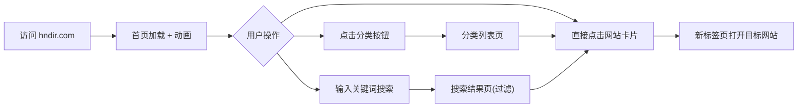

# 海南导航站 (hndir.com) 产品需求文档 (PRD)

## 1. Product Overview

海南导航站是一个面向海南本地居民和外来游客的精选网站导航平台,聚焦海南省政府机构、旅游景区、本地服务、商业品牌等网站收录。
- **主要用途**:帮助用户快速找到海南省相关官方网站、旅游资讯、本地生活服务入口
- **目标用户**:海南居民、来岛游客、商务人士、政务工作者
- **市场价值**:填补海南地区缺乏高质量垂直导航站的空白,打造"海南入口"品牌

## 2. Core Features

### 2.1 Feature Module
1. **首页**:顶部品牌区 + 搜索框 + 分类导航 + 精选网站卡片 + 热门景点展示
2. **分类浏览页**:按分类查看收录网站列表
3. **关于页**:平台介绍、联系方式、收录申请
4. **页脚**:版权、备案信息、友情链接

### 2.2 Page Details

| Page Name | Module Name | Feature description |
|-----------|-------------|---------------------|
| 首页 | 品牌 Hero | 大标题 "海南导航站",副标题 "发现海南,从这里开始",海浪/椰树装饰元素 |
| 首页 | 搜索框 | 支持站内搜索(按网站名称、分类过滤),支持百度/必应跳转搜索 |
| 首页 | 分类导航 | 政务服务、旅游景区、新闻媒体、教育文化、交通出行、商业企业、生活服务 7 大分类 |
| 首页 | 精选网站卡片 | 每个分类展示 4-6 个精选网站,含 Logo、名称、简介、网址 |
| 首页 | 热门推荐 | 轮播展示最常用/最热门的网站入口 |
| 分类浏览页 | 列表视图 | 展示该分类下所有网站,支持按字母/热度排序 |
| 关于页 | 平台介绍 | 建站目的、收录规则、联系方式、站长邮箱 |

## 3. Core Process

用户进入首页 → 浏览分类 → 点击网站跳转 / 使用搜索框 → 找到目标 → 离开

## 4. User Interface Design

### 4.1 Design Style
- **主色调**:海洋蓝 `#0ea5e9` + 热带绿 `#059669` + 沙滩金 `#f59e0b`,呼应"椰风海韵"
- **背景**:浅色基调 `#f8fafc`,顶部使用柔和的蓝绿渐变装饰条
- **字体**:中文主字体采用 `Noto Sans SC` / `PingFang SC`,标题字号 32-48px,正文 14-16px
- **按钮风格**:圆角 12px,悬停有阴影上浮效果
- **图标风格**:Lucide 图标库,线性简约风格
- **布局风格**:卡片式网格,分类区块化,留白充足
- **动效**:页面加载渐显、卡片 hover 微缩放 + 阴影、分类切换横向滑入

### 4.2 Page Design Overview

| Page Name | Module Name | UI Elements |
|-----------|-------------|-------------|
| 首页 | Hero 区 | 渐变大标题、搜索框、装饰海浪曲线 |
| 首页 | 分类卡片 | 每分类 4 列网格,含分类图标 + 网站名 + URL |
| 分类页 | 列表 | 左侧分类导航,右侧网站列表 |
| 关于页 | 内容区 | 纯文本 + 联系方式卡片 |

### 4.3 Responsiveness
- **Desktop 优先设计**(≥1024px):4 列网格
- **平板**(768-1023px):3 列网格
- **手机**(<768px):2 列网格,搜索框全屏宽度,分类标签横向滚动

## 5. 收录网站示例(初始数据)

### 政务服务
- 海南省人民政府 (hainan.gov.cn)
- 海南省政府服务网 (hainan.gov.cn/zwfw)
- 海南省公安厅
- 海南省税务局
- 海南省教育厅
- 海南省旅游和文化广电体育厅

### 旅游景区
- 三亚市旅游发展局
- 蜈支洲岛旅游区
- 天涯海角游览区
- 南山文化旅游区
- 呀诺达雨林景区
- 博鳌亚洲论坛永久会址

### 新闻媒体
- 海南日报 (hnrb.com.cn)
- 南海网 (hinews.cn)
- 海南广播电视总台
- 国际旅游岛商报

### 教育文化
- 海南大学 (hainanu.edu.cn)
- 海南师范大学
- 海南医学院
- 三亚学院
- 海南热带海洋学院

### 交通出行
- 海南航空 (hnair.com)
- 海口美兰国际机场
- 三亚凤凰国际机场
- 海南铁路 (海南环岛高铁)
- 海南省交通厅

### 商业企业
- 海南航空集团
- 椰树集团
- 海南农垦
- 海南控股

### 生活服务
- 海南天气预报
- 海南省人民医院
- 海口公交
- 三亚公交
