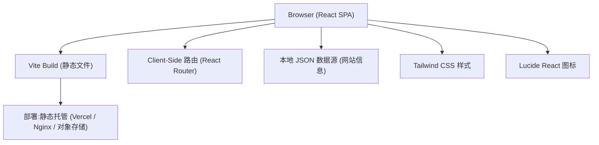

# 海南导航站 (hndir.com) 技术架构文档

## 1. Architecture Design



## 2. Technology Description

- **前端框架**:React 18 + TypeScript
- **构建工具**:Vite 5
- **CSS 框架**:Tailwind CSS 3
- **路由**:react-router-dom 6
- **状态管理**:zustand (简单页面,暂用于搜索状态)
- **图标库**:lucide-react
- **后端**:无后端,所有网站收录数据存储在前端 JSON / TS 文件中,纯静态部署
- **部署方案**:Vercel / Netlify / 任意静态托管

## 3. Route Definitions

| Route | Purpose | Component |
|-------|---------|-----------|
| `/` | 首页 - Hero + 搜索 + 全部分类精选 | `pages/Home.tsx` |
| `/category/:slug` | 分类浏览页 - 列出该分类所有网站 | `pages/Category.tsx` |
| `/search?q=` | 搜索结果页 | `pages/Search.tsx` |
| `/about` | 关于页 - 平台介绍 + 联系方式 | `pages/About.tsx` |
| `*` | 404 页面 | `pages/NotFound.tsx` |

## 4. 数据结构设计

网站目录数据存放于 `src/data/sites.ts`,采用 TypeScript 常量数组(编译期类型安全):

```typescript
interface Site {
  id: string;
  name: string;
  url: string;
  description: string;
  category: CategorySlug;
  emoji?: string;
  featured?: boolean;
  sortOrder?: number;
}

type CategorySlug =
  | 'government'
  | 'tourism'
  | 'news'
  | 'education'
  | 'transport'
  | 'business'
  | 'life';

interface Category {
  slug: CategorySlug;
  name: string;
  description: string;
  icon: string; // lucide icon name
  accentColor: string; // tailwind color class
}
```

## 5. 项目目录结构

```
/workspace
├── index.html
├── package.json
├── tsconfig.json
├── vite.config.ts
├── tailwind.config.js
├── postcss.config.js
├── src/
│   ├── main.tsx              # 入口
│   ├── App.tsx               # 路由配置
│   ├── index.css             # Tailwind 入口 + 自定义 CSS
│   ├── components/
│   │   ├── Header.tsx        # 顶部导航
│   │   ├── Footer.tsx        # 页脚
│   │   ├── Hero.tsx          # Hero 品牌区
│   │   ├── SearchBar.tsx     # 搜索框
│   │   ├── CategoryNav.tsx   # 分类导航条
│   │   ├── SiteCard.tsx      # 网站卡片
│   │   └── Section.tsx       # 分类区块容器
│   ├── pages/
│   │   ├── Home.tsx
│   │   ├── Category.tsx
│   │   ├── Search.tsx
│   │   ├── About.tsx
│   │   └── NotFound.tsx
│   ├── data/
│   │   ├── categories.ts     # 分类定义
│   │   └── sites.ts          # 网站收录数据
│   ├── hooks/
│   │   └── useSearch.ts      # 搜索逻辑
│   └── utils/
│       └── seo.ts            # 动态 title/meta
```

## 6. 设计系统(Tailwind 主题扩展)

- `colors.brand.ocean`: `#0ea5e9` (主色)
- `colors.brand.lagoon`: `#059669` (辅色)
- `colors.brand.sand`: `#f59e0b` (强调色)
- `colors.brand.sky`: `#e0f2fe` (浅色背景)
- `fontFamily.sans`: `'Noto Sans SC', 'PingFang SC', system-ui, sans-serif`

## 7. SEO 关键配置

- `<title>`:首页 "海南导航站 - 发现海南,从这里开始 | hndir.com"
- `<meta name="description">`:聚焦海南省政务、旅游、新闻、教育、交通、商业、生活服务网站的精选导航平台
- 动态 Open Graph 标签
- 中文 `lang="zh-CN"`
